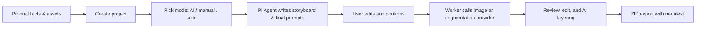

# EcomGen

[简体中文](./README.md) | English

EcomGen is a local-first AI e-commerce image suite workbench for individual sellers. It turns product facts, product assets, target markets, and platform requirements into a reviewable storyboard, then a Worker calls OpenAI-compatible image providers to generate, edit, review, layer, and export a full image set.

## Workbench preview

| Project gallery                                                | Product setup                                                  |
| ------------------------------------------------------------- | -------------------------------------------------------------- |
|  |  |

| Storyboard review                                                      | Generation results                                                     |
| --------------------------------------------------------------------- | ---------------------------------------------------------------------- |
|  |  |

## Highlights

- **Project-based workflow**: capture product description, verified facts, prohibited claims, brand rules, target market, target platform, copy language, and default generation mode.
- **Three planning modes**: `AI planning`, `manual selection`, and `suite`, with recent-config snapshots for one-click reuse of previous planning parameters.
- **Pi Agent storyboard planning**: reads built-in e-commerce templates, suites, and platform guidance to produce final prompts for the image model; includes an optional web visual-research toggle.
- **25 built-in e-commerce templates**: a customized `ecom-details-image` catalog covering hero, lifestyle, infographic, packaging, comparison, social media, and more, plus importable custom templates.
- **Suite system**: a reusable, category-classified storyboard of 5–12 shots. Ships 3 built-in suites with 22 shots total, covering 24 L1 categories and 169 L2 categories.
- **Suite Forge**: upload a set of viral reference images and let the Agent reverse-engineer a Campaign Style Lock, shot order, and per-shot prompt templates into a reusable suite template.
- **8 shot roles**: HERO / PAIN_POINT / COMPARISON / SCENE / DETAIL / TRUST / VARIANT / CTA, keeping a suite diverse across the conversion funnel.
- **Product truth & pixel protection**: distinguishes `PRODUCT_TRUTH`, packaging, and reference images; `PIXEL_PROTECTED` mode requires the current project's product-truth assets.
- **Async generation & auditability**: BullMQ Workers handle planning, copywriting, generation, editing, layering, and export jobs, persisting `compiledPrompt`, generation snapshots, and job status.
- **Provider management**: configure reasoning, image-generation, and image-segmentation providers covering OpenAI-compatible Images, Google Gemini native image generation (Nano Banana), and multiple segmentation protocols. API keys are encrypted, and the frontend never talks to providers, Redis, or SQLite directly.
- **Editing workbench**: output-branch editing with masked inpaint, product replacement, scene adjust, outpaint, references, and versioned edit sessions.
- **AI layering & multi-format export**: automatically recognize elements and export per-layer PNG, ZIP, and PSD files with visibility toggling, ordering, and history.
- **Global asset library**: browse uploads, generated outputs, and layer files across all projects, and reuse any of them in another project.
- **Review & export**: manually review results, then package everything into a ZIP with a `manifest.json`.

## Workflow



The API validates, persists, and enqueues; Pi Agent understands business rules and writes the final prompt; the Worker only checks cancellation, resources, status, and parameters, then hands the final prompt to the provider verbatim. SSE only tells the frontend to re-query; REST is the source of truth.

## Navigation

| Route            | Page           | Purpose                                                                              |
| ---------------- | -------------- | ------------------------------------------------------------------------------------ |
| `/`              | Project gallery | Create, archive, restore, and delete projects; open Suite Forge, asset library, settings |
| `/projects/:id`  | Project workbench | Setup → Storyboard → Results: assets, planning, generation, editing, layering, export |
| `/library`       | Global asset library | Manage assets, outputs, and layer files across all projects                        |
| `/suite-forge`   | Suite Forge    | Upload a viral suite and reverse-engineer it into a reusable suite template           |

## Tech stack

| Layer      | Technologies                                                                        |
| ---------- | ----------------------------------------------------------------------------------- |
| Web        | React 19, Vite, Ant Design, TanStack Query, Motion, openapi-fetch, ag-psd, fflate   |
| API        | Fastify 5, TypeBox, SQLite (better-sqlite3), SSE, multipart, Sharp                  |
| Worker     | BullMQ, Redis, Sharp, Archiver, ag-psd                                              |
| Agent      | `@earendil-works/pi-agent-core`, `@earendil-works/pi-ai`                            |
| Engineering | TypeScript ESM, pnpm workspace, Vitest, OpenAPI 3.1                                 |

## Requirements

- Windows, Node.js 22 or later
- pnpm 11 (the repo pins `11.19.0`)
- Redis 6.2 or later; a Redis 7 Docker container works for local development
- A Base64-encoded 32-byte `ECOMGEN_MASTER_KEY`
- At least one reasoning provider; image generation via OpenAI-compatible Images or Google Gemini Nano Banana

### Provider configuration examples

- **OpenAI-compatible Images**: provide a Base URL and model ID that support `/images/generations` and `/images/edits`.
- **Google Gemini native image generation**: set Base URL to `https://generativelanguage.googleapis.com/v1beta`, model ID to `gemini-2.5-flash-image`, and image API type to `gemini`. This adapter uses Gemini's native image response from `generateContent`, sending references as inline images. Gemini does not support OpenAI-style masks, so masked editing and outpainting are explicitly rejected by capability checks.
- **Image segmentation providers**: fal.ai SAM 3, self-hosted Grounded-SAM, Seedream layerize, and Gitee AI SAM 3, used for AI layer export.
- **Web search sources**: Brave, Tavily, and self-hosted SearXNG, called serially by numeric priority for visual-direction research during planning.

## Getting started

### 1. Install dependencies

```bash
corepack enable
pnpm install
```

### 2. Configure environment variables

Copy the example file:

```bash
cp .env.example .env
```

Generate a master key (never commit `.env`):

```bash
node -e "console.log(require('crypto').randomBytes(32).toString('base64'))"
```

Put the output into `ECOMGEN_MASTER_KEY`. By default the app stores SQLite, uploads, outputs, and exports under `./data`, and connects to Redis at `redis://127.0.0.1:6379`. If needed, set the Web env in `apps/web/.env`:

```dotenv
VITE_API_BASE_URL=http://127.0.0.1:8787/api/v1
```

### 3. Run the services

Make sure Redis is running, then start three processes:

```bash
pnpm dev:api
pnpm dev:worker
pnpm dev:web
```

Defaults:

- Web: the Vite dev URL (usually `http://127.0.0.1:5173`)
- API: [`http://127.0.0.1:8787`](http://127.0.0.1:8787)
- OpenAPI: [`openapi.yaml`](./openapi.yaml)

You can also start API, Worker, and Web together with the root script:

```bash
pnpm dev
```

## Docker Compose

Docker Compose starts Redis, the API, and the Worker, and stores business data in a named volume. The API also serves the Web build (`apps/web/dist`), so **only one port is exposed**. Create a root `.env` with at least `ECOMGEN_MASTER_KEY`, then run:

```bash
docker compose up -d --build
```

Open `http://127.0.0.1:8787` for the full workbench. On a VPS or remote server, use `http://<server-ip>:8787` (front it with Nginx/Caddy and HTTPS recommended). To tail logs or stop:

```bash
docker compose logs -f api worker
docker compose down
```

When deploying Web separately, `VITE_API_BASE_URL` is a **build-time** variable: set it to a browser-reachable API URL (e.g. `http://<server-ip>:8787/api/v1`) before `pnpm --filter @ecomgen/web build`; it cannot be changed afterwards. If unset, it defaults to the same-origin path `/api/v1` (proxied by Vite in local development).

## Common commands

```bash
pnpm build             # Build all workspace packages
pnpm test              # Run all Vitest tests
pnpm test:e2e:mock     # Run the full Mock API/Worker acceptance flow
pnpm verify-contracts  # Verify OpenAPI contract and generated artifacts
pnpm lint:openapi      # Lint the OpenAPI contract only
```

Per package:

```bash
pnpm --filter @ecomgen/web test
pnpm --filter @ecomgen/agent test -- --run
pnpm --filter @ecomgen/worker build
```

## Project structure

```text
apps/
  api/              Fastify API, uploads, provider config, SSE
  web/              React + Vite desktop-first workbench
  worker/           BullMQ consumers, Pi planning, generation, editing, layering, ZIP export
packages/
  agent/            Pi Agent planning and prompt-rewrite adapters
  contracts/        Cross-app domain types and TypeBox contract source of truth
  core/             SQLite, file storage, secret encryption, request fingerprinting
  ecom-skill/       Built-in e-commerce template catalog and execution profiles
  ecom-suite/       Suite catalog, taxonomy, and built-in suites
  ecom-suite-forge/ Suite Forge skill, system prompt, and reverse-engineering workflow
  jobs/             Redis, BullMQ, and the event bus
  providers/        OpenAI-compatible / Gemini / segmentation provider adapters
docs/               Product design and prototype material
openapi.yaml        API contract (generated view)
```

## Development conventions

- Add cross-app fields to the matching TypeBox schema in `packages/contracts/src` first, then run `pnpm gen:openapi` and `pnpm --filter @ecomgen/web gen:api`. `openapi.yaml`, `openapi/schemas.generated.yaml`, and the Web type file are all generated artifacts.
- Never assemble templates, platform rules, or Campaign Style Locks inside the Worker; `promptInstruction` is the editable final prompt.
- Never bypass `ecom-skill` template validation; unknown template IDs, missing `PRODUCT_TRUTH`, or insufficient provider capabilities must fail explicitly.
- API keys, the master key, and other credentials must never appear in prompts, logs, `manifest.json`, or commits.

See [`ARCHITECTURE.md`](./ARCHITECTURE.md) for runtime invariants and extension rules, [`packages/agent/README.md`](./packages/agent/README.md) for the Pi Agent tool boundary, [`apps/worker/README.md`](./apps/worker/README.md) for worker execution semantics, and [`packages/ecom-suite-forge/UPSTREAM.md`](./packages/ecom-suite-forge/UPSTREAM.md) for the Suite Forge origin.

## Acknowledgements

Thanks to [Pi](https://github.com/badlogic/pi-mono) for the Agent capabilities and [liangdabiao/ecom-details-image](https://github.com/liangdabiao/ecom-details-image) for the e-commerce template and visual guidance.

Thanks also to the [LINUX DO](https://linux.do) community for support and feedback throughout development.

The upstream templates are pinned and embedded in `packages/ecom-skill`; see [`packages/ecom-skill/UPSTREAM.md`](./packages/ecom-skill/UPSTREAM.md) for provenance and local modification boundaries.
