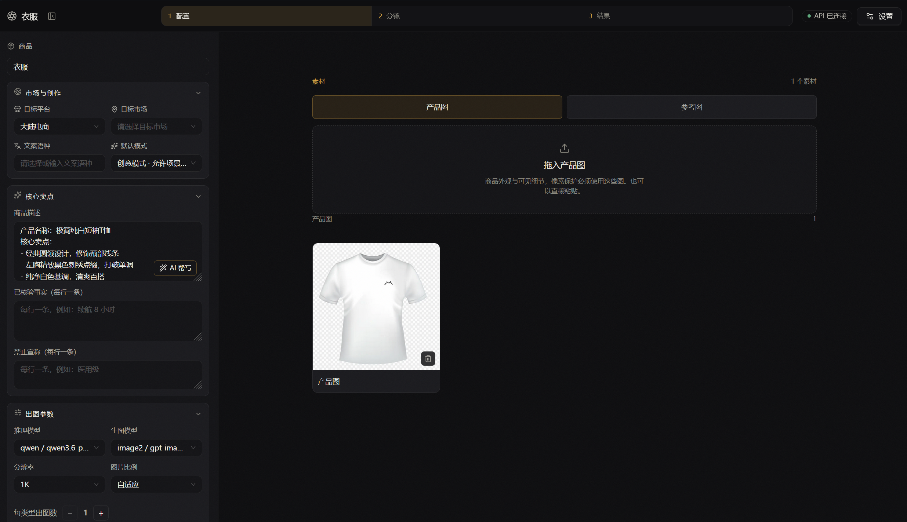
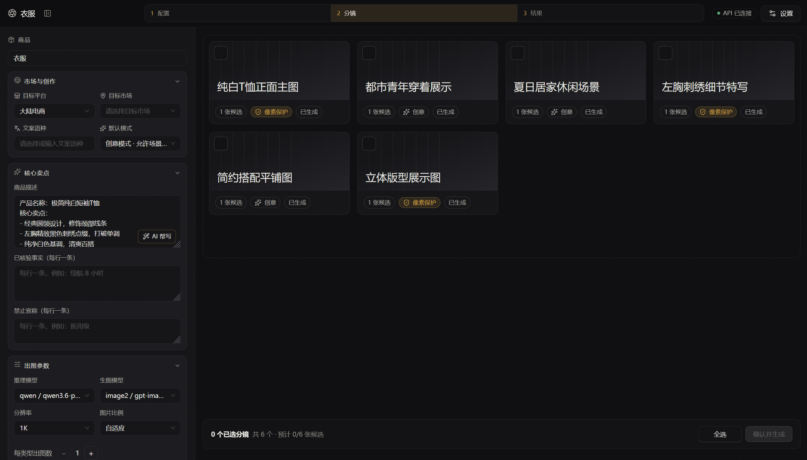
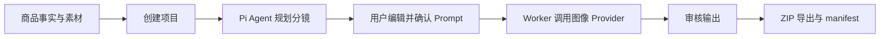

# EcomGen

EcomGen 是面向个人卖家的本地优先电商 AI 套图工作台。它把商品事实、商品素材、目标市场和平台要求整理成可审核的分镜，再由 Worker 调用兼容 OpenAI 的图像 Provider 生成、审核并导出整套图片。

## 工作台预览

| 项目入口 | 商品配置 |
| --- | --- |
|  |  |

| 分镜确认 | 生成结果 |
| --- | --- |
|  |  |

## 核心能力

- **项目化工作流**：记录商品描述、已核实事实、禁止声明、品牌规范、目标市场和平台。
- **Pi Agent 分镜规划**：读取内置电商模板和平台规范，生成可直接交给图像模型的最终 Prompt。
- **25 种电商图片模板**：内置改造后的 `ecom-details-image` 模板目录，支持主图、场景图、信息图、包装、对比和社媒等场景。
- **素材与像素保护**：区分 `PRODUCT_TRUTH`、包装图和参考图；`PIXEL_PROTECTED` 模式要求使用当前项目的商品真值素材。
- **异步生成与审计**：BullMQ Worker 处理规划、生图、编辑和导出任务，保存 `compiledPrompt`、生成快照和任务状态。
- **Provider 管理**：配置多个 OpenAI-compatible 推理/生图 Provider，API Key 加密保存，前端不会直连 Provider、Redis 或 SQLite。
- **编辑、审核与导出**：支持基于输出分支的图像编辑、人工审核和 ZIP 导出。

## 工作流



API 负责校验、持久化和入队；Pi Agent 负责理解业务规则并生成最终 Prompt；Worker 只做取消、资源、状态和参数检查，然后把最终 Prompt 原样交给 Provider。SSE 只用于通知前端重新查询状态，REST 是状态真相。

## 技术栈

| 层      | 技术                                                      |
| ------ | ------------------------------------------------------- |
| Web    | React 19、Vite、Ant Design、TanStack Query、Motion          |
| API    | Fastify 5、TypeBox、SQLite、SSE、multipart                  |
| Worker | BullMQ、Redis、Sharp、Archiver                             |
| Agent  | `@earendil-works/pi-agent-core`、`@earendil-works/pi-ai` |
| 工程     | TypeScript、pnpm workspace、Vitest、OpenAPI 3.1            |

## 环境要求

- Windows、Node.js 22 或更高版本
- pnpm 11（仓库锁定版本为 `11.19.0`）
- Redis 6.2 或更高版本；本地可使用 Redis 7 Docker 容器
- 一个 Base64 编码的 32 字节 `ECOMGEN_MASTER_KEY`
- 至少一个可用的 OpenAI-compatible Provider（用于推理或图像生成）

## 快速开始

### 1. 安装依赖

```bash
corepack enable
pnpm install
```

### 2. 配置环境变量

复制根目录示例文件：

```bash
cp .env.example .env
```

生成主密钥（不要提交 `.env`）：

```bash
node -e "console.log(require('crypto').randomBytes(32).toString('base64'))"
```

将输出写入 `.env` 的 `ECOMGEN_MASTER_KEY`。默认配置使用 `./data` 保存 SQLite、上传素材、生成结果和导出文件，使用 `redis://127.0.0.1:6379` 连接 Redis。Web 端可按需在 `apps/web/.env` 中设置：

```dotenv
VITE_API_BASE_URL=http://127.0.0.1:8787/api/v1
```

### 3. 启动服务

先确保 Redis 已启动，然后在三个终端分别运行：

```bash
pnpm dev:api
pnpm dev:worker
pnpm dev:web
```

默认地址：

- Web：Vite 输出的本地地址（通常为 `http://127.0.0.1:5173`）
- API：[`http://127.0.0.1:8787`](http://127.0.0.1:8787)
- OpenAPI：[`openapi.yaml`](./openapi.yaml)

也可以使用根脚本一次启动 API、Worker 和 Web：

```bash
pnpm dev
```

## Docker Compose

Docker Compose 会启动 Redis、API 和 Worker，并将业务数据保存到命名卷。先在根目录创建 `.env`，至少设置 `ECOMGEN_MASTER_KEY`，再运行：

```bash
docker compose up -d --build
```

API 将暴露在 `http://127.0.0.1:8787`。查看日志或停止服务：

```bash
docker compose logs -f api worker
docker compose down
```

## 常用命令

```bash
pnpm build          # 构建全部 workspace 包
pnpm test           # 运行全部 Vitest 测试
pnpm test:e2e:mock  # 运行 Mock API/Worker 完整链路验收
pnpm lint:openapi   # 校验 OpenAPI 契约
```

按包运行：

```bash
pnpm --filter @ecomgen/web test
pnpm --filter @ecomgen/agent test -- --run
pnpm --filter @ecomgen/worker build
```

## 项目结构

```text
apps/
  api/       Fastify API、上传、Provider 配置和 SSE
  web/       React + Vite 桌面优先工作台
  worker/    BullMQ 消费者、Pi 规划、生图、审核和 ZIP 导出
packages/
  agent/     Pi Agent 规划与 Prompt 改写适配器
  contracts/ 跨应用领域类型
  core/      SQLite、文件存储、加密和请求指纹
  ecom-skill 内置电商模板目录与执行画像
  jobs/      Redis、BullMQ 和事件总线
  providers/ OpenAI-compatible Provider 适配器
docs/       产品设计和原型材料
openapi.yaml API 契约
```

## 开发约定

- 新增跨应用字段先更新 `packages/contracts` 和根目录 `openapi.yaml`，再重新生成 Web 类型。
- 不在 Worker 中拼接模板、平台规则或 Campaign Style Lock；`promptInstruction` 是可编辑的最终 Prompt。
- 不绕过 `ecom-skill` 模板校验；未知模板 ID、缺少 `PRODUCT_TRUTH` 或 Provider 能力不足时必须显式失败。
- API Key、主密钥和其他凭据不得写入 Prompt、日志、`manifest.json` 或提交记录。

更完整的运行时不变量和扩展规则见 [`ARCHITECTURE.md`](./ARCHITECTURE.md)。Pi Agent 的工具边界见 [`packages/agent/README.md`](./packages/agent/README.md)，Worker 执行语义见 [`apps/worker/README.md`](./apps/worker/README.md)。

## 致谢与上游来源

感谢 [Pi](https://github.com/badlogic/pi-mono) 提供 Agent 能力，以及 [liangdabiao/ecom-details-image](https://github.com/liangdabiao/ecom-details-image) 提供电商图片模板与视觉规范。

上游模板已固定版本并内置于 `packages/ecom-skill`，来源和改造边界见 [`packages/ecom-skill/UPSTREAM.md`](./packages/ecom-skill/UPSTREAM.md)。
