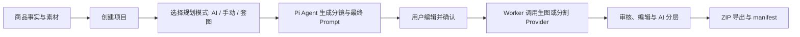

# EcomGen

简体中文 | [English](./README.en.md)

EcomGen 是面向个人卖家的本地优先电商 AI 套图工作台。它把商品事实、商品素材、目标市场和平台要求整理成可审核的分镜，再由 Worker 调用兼容 OpenAI 的图像 Provider 生成、编辑、审核、分层并导出整套图片。

## 工作台预览

| 项目入口                                                     | 商品配置                                                     |
| -------------------------------------------------------- | -------------------------------------------------------- |
|  |  |

| 分镜确认                                                            | 生成结果                                                          |
| --------------------------------------------------------------- | ------------------------------------------------------------- |
|  |  |

## 核心能力

- **项目化工作流**：记录商品描述、已核实事实、禁止声明、品牌规范、目标市场、目标平台、文案语种和默认生成模式。
- **三种规划模式**：`AI 智能规划`、`手动选择` 和 `套图`，并支持"最近配置"快照一键复用历史规划参数。
- **Pi Agent 分镜规划**：读取内置电商模板、套图与平台规范，生成可直接交给图像模型的最终 Prompt；内置联网视觉研究开关。
- **25 种电商图片模板**：内置改造后的 `ecom-details-image` 模板目录，覆盖主图、场景图、信息图、包装、对比、社媒等场景，并支持导入自定义模板。
- **套图体系**：以类目分类的可复用分镜序列（5–12 张）描述一套详情图，内置 3 套、共 22 个分镜，覆盖 24 个一级类目与 169 个二级类目。
- **套图工坊（Suite Forge）**：上传一组爆款图片，AI 反推出 Campaign Style Lock、分镜顺序和逐镜 Prompt 模板，沉淀为可复用的套图模板。
- **8 种分镜角色**：主图 / 痛点 / 对比 / 场景 / 细节 / 信任 / 变体 / 转化，保证一套图在转化漏斗上的多样性。
- **素材与像素保护**：区分 `PRODUCT_TRUTH`、包装图和参考图；`PIXEL_PROTECTED` 模式要求使用当前项目的商品真值素材。
- **异步生成与审计**：BullMQ Worker 处理规划、文案、生图、编辑、分层和导出任务，保存 `compiledPrompt`、生成快照和任务状态。
- **Provider 管理**：配置推理、生图和图像分割 Provider，覆盖 OpenAI-compatible Images、Google Gemini 原生生图（Nano Banana）以及多种分割协议，API Key 加密保存，前端不直连 Provider、Redis 或 SQLite。
- **编辑工作台**：支持基于输出分支的蒙版编辑、局部重绘、外扩、参考素材与编辑会话版本管理。
- **AI 分层与多格式导出**：自动识别画面元素并导出逐层 PNG、ZIP 与 PSD，支持图层显隐、排序和历史回看。
- **全局资产库**：集中浏览所有项目的上传素材、生成结果和分层文件，可一键复用到任意项目。
- **审核与导出**：人工审核输出质量，最终打包为 ZIP 并附带 `manifest.json`。

## 工作流



API 负责校验、持久化和入队；Pi Agent 负责理解业务规则并生成最终 Prompt；Worker 只做取消、资源、状态和参数检查，然后把最终 Prompt 原样交给 Provider。SSE 只用于通知前端重新查询状态，REST 是状态真相。

## 界面导航

| 路由                   | 页面       | 用途                                            |
| -------------------- | -------- | --------------------------------------------- |
| `/`                  | 项目画廊     | 新建、归档、恢复和删除项目，进入套图工坊、资产库与设置                   |
| `/projects/:id`      | 项目工作台    | 配置 → 分镜 → 结果三阶段，完成素材、规划、生图、编辑、分层与导出            |
| `/library`           | 全局资产库    | 跨项目管理全部素材、生成结果和分层文件                           |
| `/suite-forge`       | 套图工坊     | 上传爆款套图，反向工程为可复用套图模板                           |

## 技术栈

| 层      | 技术                                                                        |
| ------ | ------------------------------------------------------------------------- |
| Web    | React 19、Vite、Ant Design、TanStack Query、Motion、openapi-fetch、ag-psd、fflate |
| API    | Fastify 5、TypeBox、SQLite（better-sqlite3）、SSE、multipart、Sharp                 |
| Worker | BullMQ、Redis、Sharp、Archiver、ag-psd                                         |
| Agent  | `@earendil-works/pi-agent-core`、`@earendil-works/pi-ai`                     |
| 工程     | TypeScript ESM、pnpm workspace、Vitest、OpenAPI 3.1                          |

## 环境要求

- Windows、Node.js 22 或更高版本
- pnpm 11（仓库锁定版本为 `11.19.0`）
- Redis 6.2 或更高版本；本地可使用 Redis 7 Docker 容器
- 一个 Base64 编码的 32 字节 `ECOMGEN_MASTER_KEY`
- 至少一个可用的推理 Provider；图像生成可使用 OpenAI-compatible Images 或 Google Gemini Nano Banana

### Provider 配置示例

- **OpenAI-compatible Images**：填入兼容 `/images/generations` 与 `/images/edits` 的 Base URL 和模型 ID。
- **Google Gemini 原生生图**：Base URL 填 `https://generativelanguage.googleapis.com/v1beta`，模型 ID 填 `gemini-2.5-flash-image`，生图 API 类型选择 `gemini`。该适配器使用 Gemini `generateContent` 的原生图像响应，参考图以内联图片发送；Gemini 不支持 OpenAI 式蒙版，因此局部蒙版编辑和画布外扩会按能力检查显式拒绝。
- **图像分割 Provider**：支持 fal.ai SAM 3、自部署 Grounded-SAM、Seedream 图层拆分和 Gitee AI SAM 3，用于 AI 分层导出。
- **联网搜索源**：支持 Brave、Tavily 和自部署 SearXNG，按数值优先级串行调用，用于规划阶段的视觉方向研究。

## 快速开始

### 1. 安装依赖

```bash
corepack enable
pnpm install
```

### 2. 配置环境变量

复制根目录示例文件：

```bash
cp .env.example .env
```

生成主密钥（不要提交 `.env`）：

```bash
node -e "console.log(require('crypto').randomBytes(32).toString('base64'))"
```

将输出写入 `.env` 的 `ECOMGEN_MASTER_KEY`。默认配置使用 `./data` 保存 SQLite、上传素材、生成结果和导出文件，使用 `redis://127.0.0.1:6379` 连接 Redis。Web 端可按需在 `apps/web/.env` 中设置：

```dotenv
VITE_API_BASE_URL=http://127.0.0.1:8787/api/v1
```

### 3. 启动服务

先确保 Redis 已启动，然后在三个终端分别运行：

```bash
pnpm dev:api
pnpm dev:worker
pnpm dev:web
```

默认地址：

- Web：Vite 输出的本地地址（通常为 `http://127.0.0.1:5173`）
- API：[`http://127.0.0.1:8787`](http://127.0.0.1:8787)
- OpenAPI：[`openapi.yaml`](./openapi.yaml)

也可以使用根脚本一次启动 API、Worker 和 Web：

```bash
pnpm dev
```

## Docker Compose

Docker Compose 会启动 Redis、API 和 Worker，并将业务数据保存到命名卷。API 会同时托管 Web 页面（`apps/web/dist`），因此**只需暴露一个端口**。先在根目录创建 `.env`，至少设置 `ECOMGEN_MASTER_KEY`，再运行：

```bash
docker compose up -d --build
```

启动后访问 `http://127.0.0.1:8787` 即是完整工作台。部署在 VPS 或远程服务器时，用 `http://<服务器IP>:8787` 直接访问（建议前置 Nginx/Caddy 反代并配置 HTTPS）。查看日志或停止服务：

```bash
docker compose logs -f api worker
docker compose down
```

前后端分开部署（Web 托管在别处）时，`VITE_API_BASE_URL` 是**构建期**变量：在 `pnpm --filter @ecomgen/web build` 前设置为可从浏览器访问的 API 地址（如 `http://<服务器IP>:8787/api/v1`），构建后无法修改。不设置时默认走同源相对路径 `/api/v1`（本地开发由 Vite 代理转发）。

## 常用命令

```bash
pnpm build          # 构建全部 workspace 包
pnpm test           # 运行全部 Vitest 测试
pnpm test:e2e:mock  # 运行 Mock API/Worker 完整链路验收
pnpm verify-contracts  # 校验 OpenAPI 契约与生成物一致性
pnpm lint:openapi   # 只校验 OpenAPI 契约
```

按包运行：

```bash
pnpm --filter @ecomgen/web test
pnpm --filter @ecomgen/agent test -- --run
pnpm --filter @ecomgen/worker build
```

## 项目结构

```text
apps/
  api/              Fastify API、上传、Provider 配置和 SSE
  web/              React + Vite 桌面优先工作台
  worker/           BullMQ 消费者、Pi 规划、生图、编辑、分层和 ZIP 导出
packages/
  agent/            Pi Agent 规划与 Prompt 改写适配器
  contracts/        跨应用领域类型与 TypeBox 契约真相源
  core/             SQLite、文件存储、密钥加密和请求指纹
  ecom-skill/       内置电商模板目录与执行画像
  ecom-suite/       套图目录、类目分类与内置套图
  ecom-suite-forge/ 套图工坊技能、系统提示与反推工作流
  jobs/             Redis、BullMQ 和事件总线
  providers/        OpenAI-compatible / Gemini / 分割 Provider 适配器
docs/               产品设计和原型材料
openapi.yaml        API 契约（生成视图）
```

## 开发约定

- 新增跨应用字段先更新 `packages/contracts/src` 中对应 TypeBox schema，然后运行 `pnpm gen:openapi` 和 `pnpm --filter @ecomgen/web gen:api`；`openapi.yaml`、`openapi/schemas.generated.yaml` 与 Web 类型文件均为生成物。
- 不在 Worker 中拼接模板、平台规则或 Campaign Style Lock；`promptInstruction` 是可编辑的最终 Prompt。
- 不绕过 `ecom-skill` 模板校验；未知模板 ID、缺少 `PRODUCT_TRUTH` 或 Provider 能力不足时必须显式失败。
- API Key、主密钥和其他凭据不得写入 Prompt、日志、`manifest.json` 或提交记录。

更完整的运行时不变量和扩展规则见 [`ARCHITECTURE.md`](./ARCHITECTURE.md)。Pi Agent 的工具边界见 [`packages/agent/README.md`](./packages/agent/README.md)，Worker 执行语义见 [`apps/worker/README.md`](./apps/worker/README.md)，套图工坊的上游来源见 [`packages/ecom-suite-forge/UPSTREAM.md`](./packages/ecom-suite-forge/UPSTREAM.md)。

## 致谢与上游来源

感谢 [Pi](https://github.com/badlogic/pi-mono) 提供 Agent 能力，以及 [liangdabiao/ecom-details-image](https://github.com/liangdabiao/ecom-details-image) 提供电商图片模板与视觉规范。

同时感谢 [LINUX DO](https://linux.do) 社区和各位佬友在开发过程中的支持与反馈。

上游模板已固定版本并内置于 `packages/ecom-skill`，来源和改造边界见 [`packages/ecom-skill/UPSTREAM.md`](./packages/ecom-skill/UPSTREAM.md)。
