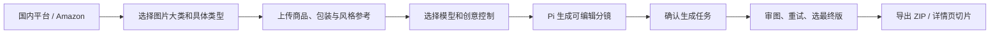

# 产品设计

## 用户目标

用户带着一个商品款的现有图片进入系统，先选择“卖到哪里”和“需要哪些图片”，再上传商品与参考素材。系统生成一份套图计划，用户确认后批量出图、选图并导出。

## 项目模型

项目是一个商品款（SPU），例如“同款保温杯”。项目内可建多个变体，例如“黑色 500ml”“白色 350ml”。每张分镜必须声明适用范围：`通用` 或一个指定变体；系统不得将不同变体的颜色、包装和配件混入同一图。

素材可带角色：

- 商品真实性参考：决定主体外观、颜色、结构和包装；
- 包装/配件参考：决定包含物和 SKU 信息；
- 风格参考：决定色板、光线和设计语言；
- 竞品构图参考：只复用构图和信息层级，不复制商品或商标。

## 创建向导

### 平台

显示可多选的 `国内平台` 和 `Amazon`。这一步选择导出档案与规则提示，不限制后续图片创意。

### 图片类型

先选择大类，再选具体项；也可选择“让 AI 推荐”。

| 大类 | 具体类型 |
| --- | --- |
| 商品主图 | 白底、纯色、搜索首图、多角度、SKU/颜色、材质细节、尺寸规格 |
| 详情页 | 首屏、卖点、结构、使用步骤、场景、包装、对比、信任、FAQ/CTA |
| 场景种草 | 生活方式、UGC、模特、平铺、试穿、直播、社媒 |
| 活动广告 | Banner、促销海报、季节 Campaign、创意概念、店铺场景 |

### 上传与创意控制

上传不设业务硬门槛。可选填写商品名称、品类、卖点、规格、品牌色和禁用元素。随后选择推理模型、生图模型、项目默认模式、视觉预设、风格参考和自由要求。

## 视觉模式

| 模式 | 承诺 | 适合的图片 | 不支持的承诺 |
| --- | --- | --- | --- |
| 创意模式 | 商品语义身份尽量一致，允许视觉创作。 | 场景、模特、广告、详情页、换角度。 | 像素或精确几何不变。 |
| 主体像素保护 | 用户商品主体作为原始像素层保留，只生成主体外部。 | 白底、背景替换、静物海报、商品展示。 | 新角度、真实遮挡、主体变形。 |

项目设定默认模式；任何分镜可单独覆盖。常见组合是主图用主体像素保护，场景图用创意模式。

## Agent 行为边界

Pi Agent 根据已选图片类型、变体、素材角色、模型能力和 `ecom-details-image` 策略包生成分镜。每张分镜包含用途、购买问题、模板、Prompt、负面约束、画幅、模式、变体、风险标签和预计任务数。

Agent 不自动提交生图，不自动增加未确认分镜，不访问本机文件/Shell/网络，不编造价格、数值规格、认证、疗效、赠品、物流承诺等事实。

## 工作台

| 区域 | 主要内容 |
| --- | --- |
| 左侧 | 项目、SPU、SKU 变体、素材库。 |
| 中央 | 套图计划或生成结果网格。 |
| 右侧 | 当前分镜、素材角色、模式、Prompt 和风险提示。 |
| 顶部 | 当前平台、推理模型、生图模型、任务状态和导出动作。 |

界面使用 Ant Design 处理 Steps、Upload、Form、Drawer、Tabs、Image Preview 和 Progress；套图分镜、图片网格和审图侧栏自定义实现。首版桌面优先，移动端仅支持查看、预览和下载。

