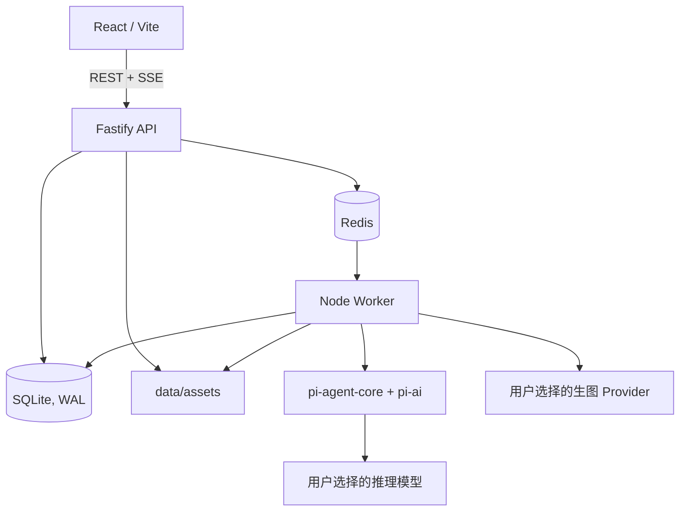

# 技术方案

## 仓库与服务边界

前后端独立开发、独立运行，但使用同一仓库和共享契约。不得让前端导入后端业务实现，也不得让后端依赖前端页面结构。

```text
apps/
  web/                 React + Vite 单页应用
  api/                 Fastify HTTP API + SSE
  worker/              Pi Agent、BullMQ 消费者、图片任务执行器
packages/
  contracts/           TypeBox Schema、生成的 API 类型、事件类型
  agent/               Pi Agent、领域工具、Skill 加载与 Prompt 编译
  providers/           推理模型与图像模型 Provider Adapter
  ecom-skill/          ecom-details-image 的版本化策略包
  platform-policy/     国内/Amazon 规则包与导出预设
data/                  本地 SQLite、素材、生成图、导出 ZIP（不提交）
docs/                  产品、架构、OpenAPI 与交接文档
```

## 运行时



### 前端

`apps/web` 使用 React、Vite、TypeScript、Ant Design、Lucide 和 TanStack Query。开发环境通过 Vite 代理 `/api` 到 Fastify；生产环境由环境变量指定 API 地址，Docker 使用反向代理将 `/api` 路由到 API 服务。[Vite 文档](https://vite.dev/config/server-options.html)

### 后端

`apps/api` 使用 Fastify、TypeBox 和 SQLite。路由按资源插件拆分：providers、projects、variants、assets、storyboards、jobs、exports、events。所有请求和响应必须由共享 Schema 校验；OpenAPI 从同一 Schema 生成或与其同步维护。

### Worker

`apps/worker` 独立于 API 运行。它消费 BullMQ 队列，调用 Pi 生成计划或修订、调用图像 Provider、轮询异步任务、写入文件与任务状态。API 只创建任务和读取状态，永不在 HTTP 请求中等待图像模型完成。

### 数据与文件

首版使用 SQLite（启用 WAL）和本地 `data/` 目录，不使用 MinIO/S3。SQLite 仅保存元数据、版本、审图结果、任务状态和审计信息；二进制文件保存在本地目录，数据库记录相对路径和 hash。

API 与 Worker 使用同一台机器及同一数据卷。任何写操作必须短事务化；长时间图片调用只在 Worker 外部执行。多用户或跨机器部署时再迁移 PostgreSQL 与 S3 适配器。

### 队列

Redis + BullMQ 负责 `plan`、`generate`、`poll`、`export` 任务。任务使用稳定 `jobId` 保证幂等；前端经 SSE 获取状态，也能在重连后通过 REST 查询快照。BullMQ 对重复 jobId、重试、退避和取消均有现成支持。[BullMQ 文档](https://docs.bullmq.io/)

## Pi 与 Provider

使用 `@earendil-works/pi-agent-core` 和 `@earendil-works/pi-ai`，不使用 Pi Coding Agent CLI。Pi 统一管理多个推理 Provider，用户选择项目的推理模型；图像模型由独立 `ImageProvider` Adapter 调用。

Pi 仅注册业务工具：读取项目上下文、读取单个 Skill 模板、读取平台档案、保存分镜计划、创建已确认的生成任务、写入审图建议。禁用文件、Shell、浏览器和任意 Web 工具。

模型能力由 Provider 配置显式描述：`supportsVision`、`supportsTools`、`supportsStructuredOutput`、`imageApiKind`。推理模型不支持视觉时，系统只根据用户填写内容和已选图片类型规划，并将该限制回传前端；不得静默切模型。

## 开发与分发

| 场景 | 运行方式 |
| --- | --- |
| 开发者 | Windows 原生运行 `web`、`api`、`worker` 三个进程，复用本机 Redis。 |
| 直接使用者 | Docker Compose 启动 `web`、`api`、`worker`、`redis`，挂载 SQLite 与 `data/` 卷。 |

Docker 面向直接使用者，不是本地开发的前置条件。

