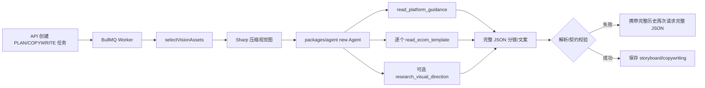

# EcomGen Agent 流程优化方案（Pi Agent）

> 状态：方案评审稿（2026-08-30）  
> 范围：只讨论 Agent、分镜规划、AI 帮写、Prompt 组装和 Provider 调用；本轮不修改源码、不改变现有契约。  
> 目标：降低 AI 帮写与分镜规划的端到端延迟、提高 Provider 侧 KV / Prompt Cache 命中、减少输入/推理/修复 Token，同时保持 `PRODUCT_TRUTH`、`PIXEL_PROTECTED`、模板校验和可审计性不变。

## 1. 结论先行

当前最值得优先做的不是把 Agent 拆成更多模型，而是把现有 Pi Agent 调用变成“可复用、可测量、少往返”的深模块：

1. **P0：建立统一 Agent 运行模块，并为每次工作流设置稳定 `sessionId` 与 Provider-aware cache policy。** 当前 `planStoryboard`、`writeCopywriting`、`planImageEdit`、`reviseImagePrompt` 都直接 `new Agent`，没有向 Pi 传递 `sessionId`；`boundedAgentStream` 只设置超时和重试。这是目前最直接的缓存缺口。
2. **P0：先采集真实 usage 和延迟，再做 A/B。** 当前 Agent 只取 assistant 文本，`AssistantMessage.usage` 没有进入任务遥测；`buildReasoningModel` 还把费率全部设为 0。没有 `cacheRead/cacheWrite/reasoning/TTFT`，无法证明优化真的生效。
3. **P1：把本地确定性知识从“逐个工具调用”收敛成一次短的 guidance digest。** `read_platform_guidance` 和 `read_ecom_template` 都是本地只读函数；逐模板返回完整 `categoryTips` 会拉长工具结果和后续上下文。应保留 Agent 的业务决策权，但让它一次拿到按任务裁剪的结构化资料。
4. **P1：用能力驱动的 Structured Output + 局部修复替代整段 JSON 重试。** 当前只有 DeepSeek 被注入 `json_object`；其它 Provider 依赖自然语言约束。校验失败后 Pi 会携带完整历史再次请求，并要求重新生成完整 JSON，形成明显的重复输入和输出开销。
5. **P1：建立视觉输入预算。** 规划/帮写目前最多选择 6 张商品图 + 6 张参考图；压缩只解决单图体积，不能解决多轮重复。应按任务和模板角色选择最少必要图片，并在有可靠视觉摘要后让后续轮次只保留摘要/必要图片。
6. **P1：按任务动态设置 reasoning level 和输出上限。** 分镜规划目前只区分“有 reasoning 就 medium”；自定义 Pi stream 没有显式的任务级 `maxTokens` 配置。应先记录实际 Provider 请求，再按复杂度选择 `off/minimal/low/medium`，并按目标图数设置输出预算。
7. **P1：集中管理工具轮次和 Provider 重试。** 当前 Pi 工具循环没有项目级轮次预算，stream 则统一设置 2 次重试；重复工具调用或完整请求重试都可能成倍放大延迟与 Token。应按工作流、工具幂等键和错误类型显式控制。
8. **P2：做精确结果缓存与 Responses API 评估。** 对同一项目事实、素材哈希、模板版本和请求参数的重复任务，可以直接复用已确认结果；对支持 Responses 的 Provider，再评估持久 reasoning/context。两者都应在 P0/P1 的指标稳定后推进。

建议目标（均为待实验的验收目标，不是当前事实承诺）：

| 指标 | 建议目标 | 说明 |
| --- | ---: | --- |
| 分镜 P50 端到端耗时 | 下降 30% 以上 | 不把搜索等待和队列等待混为一项；分别统计 |
| AI 帮写 P50 耗时 | 下降 25% 以上 | `PRODUCT_DESCRIPTION` 与 `PLANNING_INSTRUCTION` 分开比较 |
| 首次结构化输出通过率 | 不低于基线，目标提升 10 个百分点 | 不能用吞错换速度 |
| Agent 输入 Token | 下降 30% 以上 | 计算 `input + cacheRead + cacheWrite`，不是只看未缓存 input |
| 同一 Agent 会话 cache hit ratio | 首先达到 60%，再以 Provider 实测为准 | 不对跨 Provider 设统一保证 |
| JSON 修复率 | 低于 5% | 修复仍失败时必须显式失败 |
| 业务质量 | 人工接受率、事实违规率不劣于基线 | `PIXEL_PROTECTED` 和 `PRODUCT_TRUTH` 优先级最高 |

## 2. 当前 Agent 链路与源码证据



| 位置 | 当前行为 | 对速度、Token、缓存的影响 |
| --- | --- | --- |
| `apps/worker/src/worker.ts::executePlan` | 每个规划任务创建新 Agent；先选择视觉素材、压缩图片，再调用 `planStoryboard` | 任务之间没有可复用的 Agent session；同一任务的工具轮会重复发送前缀和图片 |
| `packages/agent/src/planner.ts::planStoryboard` | 创建 2 个本地业务工具（搜索开启时再加研究工具），首轮要求完整 JSON；校验失败再 `agent.prompt` 一轮 | 工具结果和初始用户输入进入后续请求；失败修复会重复整段 transcript |
| `packages/agent/src/tools.ts::createPlanningTools` | 模板工具按一个模板读取，返回 `visualFields`、完整 `categoryTips`、反 AI 提示等；平台工具单独读取 | 确定性知识被拆成多个模型往返，工具输出可能比最终需要的字段大很多 |
| `apps/worker/src/visual-assets.ts::selectVisionAssets` | 最多 6 张 `PRODUCT_TRUTH` + 6 张其它图，按创建时间选择 | 对视觉理解安全但偏宽；不区分规划、帮写、编辑任务的图片预算 |
| `apps/worker/src/worker.ts::compressForVision` | 最长边 1024、JPEG 质量 80，512 KiB 内透传 | 已经降低单图传输量，但每次任务仍会读盘和压缩；不能避免多轮重复图片输入 |
| `packages/agent/src/stream.ts::boundedAgentStream` | 只注入 240 秒超时和 2 次 Provider 重试 | 没有统一传入 `sessionId`、cache retention、usage 采集或请求标签 |
| `packages/providers/src/reasoning-profile.ts::buildReasoningModel` | `contextWindow=128000`、`maxTokens=16384` 固定；费率全为 0；当前低层 stream 未显式设置逐任务 `maxTokens` | 模型元数据与实际请求预算可能脱节；需要先观测请求 payload，再按工作流约束输出 |
| `packages/agent/src/json-response.ts::withJsonObjectResponse` | 仅按 DeepSeek 模型名/URL 注入 `response_format=json_object` | 其它 Provider 没有 Structured Output；并且 Provider 能力判断泄漏到通用 Agent 层 |
| `packages/agent/src/planner.ts::reviseImagePrompt` | 每次 revision 新建 Agent，发送完整旧 Prompt + revision | 不能复用编辑会话前缀；若重复修订，输入与系统提示反复计算 |

现有的请求指纹和 BullMQ 任务复用应保留。它已经能避免相同请求在 `QUEUED/RUNNING/SUCCEEDED` 状态下重复执行；后续的结果缓存应建立在这个不变量之上，而不是绕开它。

## 3. KV / Prompt Cache 的可用事实与限制

### 3.1 Pi 0.84.2 的能力

本项目安装的 `@earendil-works/pi-agent-core` 与 `@earendil-works/pi-ai` 为 0.84.2。Pi `Agent` 接口已经支持 `sessionId`，并会将其转发给每次 `streamFn` 调用；`StreamOptions` 也有 `cacheRetention`、`sessionId`、`maxRetryDelayMs`。Pi 的 OpenAI-compatible adapter 会解析 `prompt_tokens_details.cached_tokens`、`prompt_cache_hit_tokens` 和 `cache_write_tokens`，映射到 `usage.cacheRead/cacheWrite`。

当前代码没有使用这些能力：四个 Agent 构造函数都只设置 `initialState`，`boundedAgentStream` 没有补充缓存选项；Worker 也没有读取 assistant usage。这意味着“缓存是否命中”目前只能推测，不能验证。

Pi 官方 Agent 源码中的 `sessionId` 语义见 [Pi Agent](https://github.com/earendil-works/pi/blob/main/packages/agent/src/agent.ts)。

### 3.2 OpenAI

OpenAI 会缓存完整渲染上下文中的稳定前缀，包括 developer/system、工具定义、对话历史、工具调用结果和多模态内容；缓存复用要求断点之前的前缀完全匹配。[Prompt caching 文档](https://developers.openai.com/api/docs/guides/prompt-caching) 还明确说明：

- GPT-5.6 及更新模型的最小可缓存前缀为 1,024 个可见输入 Token；旧模型通常为 2,048。
- 工具名称、描述、schema、顺序，`reasoning.effort`、结构化输出格式和 compaction 都可能改变可复用前缀。
- 应把稳定指令和共享资料放在前面，把项目变化、时间戳和当前请求放在断点之后；应追加历史，不要重写旧消息。
- `prompt_cache_key` 用于把相似请求路由到更可能拥有同一缓存的机器，但不保证命中；高流量时应使用稳定、可分片的 key。
- 现代模型可使用 `prompt_cache_options`；旧模型使用 `prompt_cache_retention`。不能把新字段或长 TTL 盲发给未知兼容 Provider。
- `cached_tokens`、`cache_write_tokens`、延迟和总成本必须一起观察；缓存只减少输入预填充/输入成本，不改变输出生成方式。

对于本项目，稳定前缀应至少包含：版本化的 Agent system prompt、固定工具定义、输出 schema 版本。项目事实和视觉图是任务动态部分，应放在稳定区之后；同一任务的工具往返仍可以复用这段前缀。

### 3.3 Gemini

Gemini 2.5 及更新模型默认启用隐式缓存；Gemini 2.5 Flash/Pro 的文档最小输入 Token 为 2,048，更新的 Flash 型号可能为 4,096。官方建议把大量共同内容放在 prompt 开头，并在较短时间内发送相似前缀；可从 `usage.total_cached_tokens` 观察命中。[Gemini Context Caching](https://ai.google.dev/gemini-api/docs/caching)

因此 Gemini 的策略应偏向稳定前缀和短时间内复用，不应假定 OpenAI 的 `prompt_cache_key` 或 `24h` 字段对它有效。

### 3.4 DeepSeek 与百炼/Qwen

DeepSeek 文档说明其磁盘 Context Caching 默认开启，但只有完整匹配已持久化的 prefix unit 才算命中；请求边界、公共前缀和固定 Token 间隔都可能形成缓存单元。[DeepSeek Context Caching](https://api-docs.deepseek.com/guides/kv_cache/)

百炼官方文档说明，显式/隐式 Context Cache 的最小长度为 1,024 Token；显式缓存通常 5 分钟，工具定义会参与计算，工具列表顺序、字段顺序和字段结构都必须一致。文档还说明 OpenAI-compatible、DashScope、Anthropic-compatible 入口的缓存行为不同，不能仅凭“Qwen”模型名推断。[百炼 Context Cache](https://help.aliyun.com/zh/model-studio/context-cache)

因此 `dashscope_qwen` 应作为独立的 Provider capability profile 评估：是否支持 `cache_control`、是否支持长 TTL、是否需要 session-affinity，均应通过 profile 和连通性测试表达，不能在 Agent 里按 URL/模型名猜测。

## 4. 推荐目标架构

### 4.1 Stable Agent Session Module（P0，Strong）

**Files / Module**

- 外部 seam：`packages/agent` 的四个公开工作流入口。
- 内部 Adapter：Pi `Agent` + `boundedAgentStream`。
- 相关 Provider seam：`packages/providers/src/reasoning-profile.ts`。

**Problem**

四处重复创建 Agent，调用方要分别了解 system prompt、thinking level、超时、重试和未来的缓存选项。这个 Module 的 interface 目前很浅：几乎把 Pi 的实现细节暴露给每个工作流。更关键的是没有稳定 `sessionId`，所以无法可靠利用 Pi 已提供的 cache-aware backend 能力。

**Solution**

增加统一的 Agent factory/运行配置概念（本轮只记录设计，不实现）：

```text
AgentRunContext
  workflow: PLAN | COPYWRITE | EDIT_PLAN | PROMPT_REVISION
  promptVersion: hash(systemPrompt + toolSchema + outputSchema + skillHash)
  sessionId: stable short id
  cachePolicy: NONE | SHORT | LONG
  thinkingPolicy: OFF | MINIMAL | LOW | MEDIUM
  outputBudget: task-specific limit
```

推荐的 key 组成：`workflow + promptVersion + project-or-edit-session-scope`。同一 workflow 的不同项目不要共用包含项目动态内容的 session；若要共享全局 system/tools 前缀，使用 Provider 支持的稳定 `prompt_cache_key`，并把项目事实放在后缀。任何 system prompt、工具 schema、输出 schema、模板 hash 或 Provider profile 变化都应生成新版本，避免旧缓存与新语义混用。

**Cache policy**

- 单次规划/帮写通常使用 `short` 即可；同一任务的首轮与工具轮在数分钟内完成。
- 编辑 revision 若可能跨越 5 分钟，再按 Provider capability 选择 `long`；不支持时保持 `short`，不要发送未知字段。
- compaction/摘要、一次性错误修复等不应默认写入长期缓存。
- 不对所有 OpenAI-compatible Provider 承诺 `sessionId` 一定命中；它只在 Provider adapter 真正使用该字段时有路由/缓存价值。

**Benefits**

这是一个真正的 seam：以后切换 Pi adapter、Provider cache policy 或 request telemetry，不需要修改四个业务工作流。它的 Depth 来自把 session、缓存、重试、usage 采集和生命周期统一隐藏在一个小 interface 后面，带来较高 Leverage 和 Locality。

**Before / After**

```text
Before: plan -> new Agent -> stream
        copy -> new Agent -> stream
        edit -> new Agent -> stream
        revise -> new Agent -> stream

After:  workflow -> AgentRunModule(workflow, version, session, policy)
                  -> Pi Agent -> Provider Adapter
```

**Recommendation strength：Strong**

### 4.2 UsageTelemetry Adapter（P0，Strong）

**Problem**

当前四个工作流只取最终文本，不读取 `AssistantMessage.usage`。`buildReasoningModel` 的费率也设为 0，因此无法知道慢在哪里、输入 Token 是否主要是图片、修复轮是否占主要成本，或 cache hit 是否真的提升。

**Solution**

在 Agent factory 的生命周期 seam 采集并关联 `jobId`，至少记录：

- `workflow`、Provider、model、reasoning level、prompt/schema/tool version。
- turn index、工具名、工具调用次数、工具耗时、搜索耗时和结果字节数。
- request start、HTTP response、首个 token/首个事件、turn end、job end 时间。
- `input`、`output`、`reasoning`、`cacheRead`、`cacheWrite`、`totalTokens`。
- 图片数量、压缩后总字节、图片 Token（若 Provider 返回）、是否使用 vision digest。
- 首次 schema 通过、局部修复、完整重试、最终失败。

定义：

```text
totalInputTokens = input + cacheRead + cacheWrite
cacheHitRatio     = cacheRead / max(totalInputTokens, 1)
repairOverhead    = repairTurnTokens / max(firstTurnTokens, 1)
```

其中 Pi 的 `input` 是未命中输入；不能把 `input` 单独当作完整 prompt 成本。

**Benefits**

把“缓存优化”从猜测变成可验证的 Module。其 Adapter 可以先写日志或任务扩展字段，后续再接 SQLite；不会把 Provider 凭据写入日志。

**验收**

先对 30–50 个代表性项目采集基线，再逐项打开 session、digest、视觉预算、结构化输出和低 reasoning。每项只改变一个变量，比较 P50/P95、TTFT、总 Token、cacheHitRatio、首次通过率和人工接受率。

**Recommendation strength：Strong**

### 4.3 GuidanceDigest Module（P1，Worth exploring）

**Problem**

`read_platform_guidance` 和 `read_ecom_template` 是确定性本地知识，但 Agent 需要先产生工具调用，再等待结果，再产生最终 JSON。每次模板读取还可能返回完整 `categoryTips` 和反 AI 资料；对 12 个目标图，工具结果会显著增加后续上下文。

**Solution**

保留 `packages/ecom-skill` 作为规范来源，但增加一个短、版本化的 guidance digest seam：

```text
read_planning_context({ requestedTypes, productCategory, platformTargets })
  -> platformRules
  -> selectedTemplateSummaries[]
  -> topCategoryTips[]
  -> templateHash / guidanceVersion
```

设计要点：

- MANUAL：按 `requestedTypes` 一次读取，保持原顺序；不让平台规则增删用户选择的类型。
- AI：先用现有 product-family 解析缩小到 top-K 模板摘要；选定后再按需读取一个模板的细节。无法可靠归类时显式回退完整目录，不能因裁剪静默漏掉模板。
- `categoryTips` 先按商品品类/产品族裁剪到少量候选，保留“无匹配时从事实继续”的语义；不要把整份上游清单复制到每个工具结果。
- 结果字段固定顺序、固定命名和固定序列化，避免同一工具定义/结果因字段顺序变化破坏缓存。
- 搜索结果仍是不可信视觉灵感；研究内容单独放在后缀，不进入商品事实或可长期共享的稳定前缀。

**Before / After**

```text
Before: model -> template(1) -> model -> template(2) -> ... -> model -> final JSON
After:  model -> planning_context(batch digest) -> model -> final JSON
```

**Benefits**

把“读取规范、裁剪字段、版本化摘要”集中在一个深 Module；模板变化只需修改该 Module 的 Implementation。减少工具 turn 和上下文膨胀，同时保持 Agent 仍负责选择和改写最终 Prompt。

**风险**

过度裁剪可能让某些细分品类失去必要提示。先记录“摘要命中/回退到完整模板”的比例，并用人工接受率和事实/版式违规率做质量门槛。

**Recommendation strength：Worth exploring**

### 4.4 Structured Repair Module（P1，Strong）

**Problem**

`planStoryboard` 首轮失败时，当前实现再次使用同一个 Agent，并要求返回完整 storyboard JSON。由于 Pi 会携带已有 transcript，这会重复发送项目输入、工具调用、工具结果和首轮完整 JSON；输出也再次生成全部 item。`withJsonObjectResponse` 目前只针对 DeepSeek 注入 JSON mode，通用 Provider 没有 schema 级约束。

**Solution**

按 Provider capability 逐级选择：

1. 支持严格 JSON Schema 的模型：使用版本化 schema，`additionalProperties=false`，把 enum、数组边界和必填字段交给 Provider。
2. 只支持 JSON mode 的模型：使用 `json_object`，保留本地 TypeBox 校验。
3. 不支持结构化输出的模型：保留文本 JSON 约束，但把 system prompt 和 schema 文本缩短。
4. 校验失败时优先请求 **局部 patch**（例如 JSON Pointer/RFC 6902 或固定 `replaceItems` 结构），本地应用并重新校验；只有 patch 无法修复时才允许一次完整重试。
5. 修复提示只包含结构化错误路径、允许值和必要的片段，不回显凭据或整份项目资料。

输出 schema 的版本应进入 `promptVersion`，因为 OpenAI 文档明确将 `text.format` 视为会影响缓存前缀的设置。[Structured Outputs](https://developers.openai.com/api/docs/guides/structured-outputs) 说明，符合 schema 的输出可以减少错误格式的验证/重试。

**Benefits**

把“Provider 能力适配、局部修复、契约校验”集中到一个 Module；减少完整修复轮的输入与输出 Token，失败原因更可见，不通过吞错或伪造成功隐藏问题。

**Recommendation strength：Strong**

### 4.5 Context/Attachment Budget Module（P1，Worth exploring）

**Problem**

当前规划和帮写都调用 `selectVisionAssets`，最多 12 张图；`compressForVision` 虽把每张图压到 1024 边长，但同一 Agent 的后续请求仍可能重放初始多模态消息。多图、多工具轮会造成上下文近似 O(N²) 增长。

**Solution**

按任务定义视觉预算，而不是复用一个全局上限：

| 工作流 | 默认视觉预算（建议起点） | 回退条件 |
| --- | --- | --- |
| MANUAL 分镜 | 1–2 张商品真值图 + 必要参考图 | 模板需要多角度/包装时追加对应角色 |
| AI 分镜 | 2–3 张商品真值图 + 0–2 张参考图 | 品类识别不确定时才追加 |
| PRODUCT_DESCRIPTION | 1–2 张商品真值图 | 只有视觉事实缺失才追加 |
| PLANNING_INSTRUCTION | 1 张商品真值图 + 相关参考图 | 用户明确指定风格时追加 |
| 编辑规划 | 源图 + 用户选定参考图 | 不能用参考图替代 `PRODUCT_TRUTH` |

同时建立衍生图缓存：按原图 hash、裁剪策略、尺寸、质量和 MIME 组成 key；同一项目的 PLAN/COPYWRITE/EDIT 复用压缩结果。缓存只用于推理输入；生图和 `PIXEL_PROTECTED` 仍读取原始文件。

当需要多轮 Agent 工具调用时，推荐使用 Pi 的 `transformContext` seam：

- 首轮保留真实图片和完整角色 manifest。
- 首轮完成视觉观察后，生成结构化 `visionDigest`（可观察外观、颜色、形状、可见文字、置信度、未知项）。
- 后续轮次把已处理图片替换为 digest + asset ID；仅在 digest 不足以支持当前模板时保留对应图片。
- `PRODUCT_TRUTH` 的不确定字段必须显式标记为未知，不能通过摘要变成事实。

这不是“盲目删除图片”：如果没有可靠 digest，宁可保留必要图片并让 Provider 缓存，而不是牺牲像素保护语义。

**Recommendation strength：Worth exploring**

### 4.6 Reasoning and Output Budget Module（P1，Strong）

**Problem**

`buildReasoningModel` 的模型元数据固定为 `maxTokens=16384`、`contextWindow=128000`，而 `planStoryboard` 对所有有 reasoning 的模型使用 `medium`。但当前 `boundedAgentStream` 直接调用 Pi 的低层 `openAICompletionsApi().stream`，没有显式传入逐任务 `maxTokens`；因此不能假定 16,384 已作为 Provider 请求上限生效。手动分镜、短帮写和简单 revision 也不需要同样的推理与输出预算。

**Solution**

- MANUAL 分镜：默认 `off` 或 `low`，因为类型和顺序已由用户确定。
- AI 分镜：先 A/B `low` 与 `medium`；仅在多品类、不完整事实、视觉歧义或首次校验失败时升级。
- 帮写：保留 `thinking=off`，按 target 设置明确的可见输出预算；400 字符产品描述不应携带 16K 上限。
- revision：默认 `off/low`，输出完整 Prompt 或 patch 的预算由原 Prompt 长度计算。
- 先在不记录敏感内容的前提下观测实际请求 payload，确认各 Provider 收到的是 `max_tokens`、`max_completion_tokens`、其它兼容字段，还是 Provider 默认值。
- 同时确认 Pi 的 `thinkingLevel` 是否在当前低层 stream 路径映射为 Provider 所需的 `reasoning_effort`、`enable_thinking` 或兼容字段；配置对象里显示 `medium` 不等于网络请求已启用同等推理预算。
- 确认 capability 后，在统一 stream Adapter 中按 `contextWindow - estimatedInput - safetyMargin` 动态裁剪；至少拆成 PLAN/COPY/EDIT 三档，并记录截断率。
- 若 Provider profile 声明支持 `thinking_token_budget`，将 reasoning 预算与可见回答预算分开；不支持时不要伪造该参数。

OpenAI 文档指出，降低 reasoning effort 可带来更快响应和更少 reasoning tokens；同时建议速度/成本优先的明确任务使用低延迟模型。[Reasoning best practices](https://developers.openai.com/api/docs/guides/reasoning-best-practices)

**Recommendation strength：Strong**

### 4.7 Tool-loop and Retry Governor（P1，Worth exploring）

**Problem**

Pi Agent 会在存在工具调用时继续循环；当前项目没有为 `read_ecom_template`、`read_platform_guidance`、`research_visual_direction` 设置工作流级轮次预算或相同参数的幂等规则。与此同时，`boundedAgentStream` 对所有工作流统一设置 `maxRetries=2`：一次瞬时 Provider 失败理论上会重新发送完整请求，逻辑上的 JSON 修复又是另一套完整重试。两类重试叠加会扩大 P95 延迟和输入 Token。

目前没有证据表明生产任务已出现失控循环，因此这里不是先武断降低全局上限，而是先让工具轮次、传输重试和逻辑修复分别可见。

**Solution**

- 在统一 Agent Module 使用 Pi 的 turn/tool 生命周期 seam，记录 `tool_rounds`、`tool_result_tokens`、`retry_count` 和每轮耗时。
- 对本地只读工具按 `(toolName, canonicalArgs)` 建立单次运行内的幂等结果；相同参数再次调用直接复用同一结果并记录重复调用，不再次膨胀不同版本的结果。
- 对 PLAN 设置显式预算：平台 guidance 最多一次、每个模板最多一次、研究工具最多一次；超过预算时返回可审计的显式错误，不伪造结果。
- 区分超时、连接失败、429、5xx、已开始输出后的断流和契约校验失败；只对已证明安全的瞬时错误重试，并按 PLAN/COPY/EDIT 分别 A/B 重试次数。
- Provider 传输重试与 Structured Repair 必须分别统计；修复失败不能被算作网络重试，也不能吞错后返回半成品。

**Benefits**

这是一个集中式深 Module：业务调用方不需要自行判断“还应不应该调工具或重试”。它能限制异常长尾，同时保留真实失败和完整 audit。是否收紧默认预算，以成功率、P95、Token 和质量实测决定。

**Recommendation strength：Worth exploring**

### 4.8 Exact Artifact Cache（P2，Worth exploring）

**Problem**

现有请求指纹解决的是同一个请求的任务复用，但用户改变 `regenerationKey` 或重新提交相同语义输入时，仍可能再次调用 Agent。对于无联网研究、素材和模板都未变化的项目，这些结果具备精确复用条件。

**Solution**

在现有 job fingerprint 之上增加显式结果缓存（先设计，不立即实现）：

```text
artifactKey = hash(
  workflow,
  normalized project facts,
  prohibited claims,
  brand guidelines,
  platform/market/language,
  selected asset hashes + roles,
  template hash,
  output schema version,
  provider/model profile,
  research policy/time window
)
```

- `webResearch` 开启时必须把搜索策略/时间窗口/结果快照纳入 key，或默认不复用跨时段结果。
- 只缓存成功且已通过契约校验的 storyboard/copywriting；缓存命中仍返回可审计来源和版本。
- 用户明确要求 regeneration 时绕过结果缓存，但仍可复用稳定 Agent 前缀。
- `PIXEL_PROTECTED` 必须把当前 `PRODUCT_TRUTH` 素材 hash 纳入 key，不能复用缺少当前素材的结果。

**Recommendation strength：Worth exploring**

### 4.9 Responses API / 持久 Reasoning 评估（P2，Speculative）

**Problem**

项目当前统一构造 `openai-completions` Model。OpenAI 文档说明 Chat Completions 是 stateless，reasoning items 不会在多轮函数调用间保留；Responses API 在合适配置下可保留相关 reasoning items，降低复杂 Agent 轮次的重复推理。[Reasoning best practices](https://developers.openai.com/api/docs/guides/reasoning-best-practices)

**Solution**

仅对明确支持 Responses 的 Provider 增加独立 Adapter 和 capability profile；不要把所有 OpenAI-compatible URL 直接切换。先以同一批任务比较：

- Chat Completions + session/cache policy；
- Responses + persisted reasoning/context；
- 首次通过率、reasoning tokens、TTFT、工具轮数和最终质量。

如果 Provider 是 DashScope、DeepSeek、私有 vLLM 或其它兼容网关，保持现有 transport，直到有协议级证据和测试。

**Recommendation strength：Speculative**

## 5. Web Research 的专项方案

联网研究是当前最容易拉长尾延迟的部分。现有 `research_visual_direction` 会按 source 顺序串行尝试，任一成功就返回；失败才切换备用源。这种失败策略是正确的，但不应让每个分镜 item 自己重复研究。

建议：

1. 在 Worker 准备阶段与视觉衍生图压缩并行启动一次研究任务；Agent 只接收一次限长 digest。
2. 研究 query 由 `productCategory + platformTargets + visual intent` 组成，不搜索项目已提供的商品事实。
3. 以 `(query normalized, source config hash, time window)` 做短 TTL 缓存；缓存只保存标题/摘要/视觉属性，不保存 URL 之外的商品事实。
4. 限制结果条数和字节数；超过预算时保留多样性而不是追加全文。
5. 研究不可用时保留显式工具错误与 audit，不伪造“已搜索”或静默改变商品事实。

研究结果放在动态后缀，或放在有独立版本的 digest 区，不要改变所有项目共用的稳定 system/tools 前缀。

## 6. 分阶段实施路线（仍需后续批准后才写代码）

### Phase 0：基线与能力盘点

- 完成 UsageTelemetry Adapter 的设计和字段清单。
- 对当前 OpenAI-compatible、DashScope/Qwen、DeepSeek、Gemini 配置逐一确认：是否报告 cache read/write、是否支持 JSON mode/schema、是否支持 cache control、是否支持 session affinity、上下文上限和 reasoning 参数。
- 固定 30–50 个代表任务：MANUAL/AI 分镜、两类帮写、编辑 revision，覆盖有/无研究、1/6/12 张目标图、`PIXEL_PROTECTED`。

### Phase 1：低风险高收益

- 统一 Agent factory：sessionId、短/长缓存策略、workflow/promptVersion 标签、turn usage 采集。
- 为 PLAN/COPY/EDIT/REVISION 分配不同 session namespace。
- 清理 system prompt 和 tool description 中重复指令；保持稳定前缀和固定工具顺序。
- 为四类任务引入动态 thinking/output budget，但先以配置和 A/B 形式验证。

### Phase 2：减少往返和重复上下文

- 引入 `read_planning_context` 批量 digest，并保留完整模板回退 seam。
- 为视觉输入建立按 hash 的压缩衍生缓存和任务级图片预算。
- 对多轮工具流验证 `transformContext + visionDigest`，只在视觉质量不下降时启用。
- Structured Output 优先覆盖能严格支持的 Provider；其余保持现有 fallback。

### Phase 3：减少失败重试与重复任务

- 局部 JSON patch 修复；完整重试仅作最后一次回退。
- 在请求指纹上增加成功 artifact cache，明确联网研究和 regeneration 的失效规则。
- 评估研究 digest 的短 TTL 缓存和与图片准备的并行化。

### Phase 4：可选 transport 升级

- 对支持 Responses 的 Provider 做小流量对照实验。
- 只有在质量、兼容性和成本都满足条件时，增加 Responses Adapter；不改动现有 OpenAI-compatible 适配器的语义。

## 7. A/B 实验设计

每次只改变一个主要变量，并保留完整输入/输出审计（不含凭据）：

| 实验 | 变量 | 主要观察 |
| --- | --- | --- |
| A | 当前基线 | P50/P95、总 Token、首次通过率 |
| B | 仅加入稳定 sessionId/cache policy | cacheRead、TTFT、Provider 路由差异 |
| C | B + system/tool/payload 分段与 canonical JSON | 前缀长度、cacheHitRatio、跨任务稳定性 |
| D | C + guidance digest | 工具轮数、工具结果字节、质量回退率 |
| E | D + 视觉预算/衍生缓存 | 图片 Token、磁盘耗时、视觉质量 |
| F | E + low/minimal reasoning + 动态 output budget | reasoning tokens、JSON 修复率、人工接受率 |
| G | F + Structured Output/patch repair | 完整重试率、修复 Token、失败可解释性 |

最低验收门槛：

- 任何优化不能增加事实违规、`PRODUCT_TRUTH` 误识别或 `PIXEL_PROTECTED` 违规。
- 首次结构化输出通过率不低于基线；若下降，回滚该变量而不是增加隐式重试。
- cache hit ratio 只在相同 Provider/model/profile/session 范围内比较；跨 Provider 只比较端到端效果。
- 记录缓存写入成本：OpenAI GPT-5.6 及更新模型、百炼显式缓存等可能对 cache write 按更高倍率计费；只有复用次数足够时才值得写入。

## 8. 不建议做的事情

- 不要把每个分镜 item 拆成独立 Agent 请求；这会破坏共同的 `campaignStyleLock`，并把一次规划变成 N 次完整上下文请求。
- 不要把 25 个模板的完整资料全部塞进 system prompt；这会增加每个任务的输入，也会让模板更新频繁破坏稳定前缀。
- 不要为了“命中缓存”把项目动态事实放到全局共享 key 中；缓存命中不能替代事实隔离。
- 不要对未知 OpenAI-compatible Provider 盲发 `prompt_cache_options`、`prompt_cache_retention`、`cache_control` 或 session-affinity header。
- 不要为了减 Token 全局删除商品图片，也不要把视觉摘要当成未经验证的商品事实。
- 不要用每轮 compaction 解决上下文增长；compaction 会改变前缀，可能降低 cache reuse。先做任务级预算、工具结果裁剪和 `transformContext`。
- 不要把“缓存命中”当作输出 Token 变少；缓存主要优化输入预填充和输入成本，输出预算仍需单独控制。

## 9. 参考资料

- [OpenAI Prompt caching](https://developers.openai.com/api/docs/guides/prompt-caching)：稳定前缀、最小缓存长度、工具定义、cache key、TTL、usage 字段。
- [OpenAI Create chat completion](https://developers.openai.com/api/reference/resources/chat/subresources/completions/methods/create)：`prompt_cache_key`、`prompt_cache_options`、`cached_tokens`、`cache_write_tokens`、`reasoning_effort` 和 Structured Output 参数。
- [OpenAI Structured model outputs](https://developers.openai.com/api/docs/guides/structured-outputs)：用 JSON Schema 降低格式错误和重试。
- [OpenAI Reasoning best practices](https://developers.openai.com/api/docs/guides/reasoning-best-practices)：速度/成本与 reasoning effort 的权衡，以及 Chat Completions stateless 的限制。
- [Gemini Context caching](https://ai.google.dev/gemini-api/docs/caching)：隐式缓存、模型最小 Token 和稳定前缀建议。
- [DeepSeek Context Caching](https://api-docs.deepseek.com/guides/kv_cache/)：prefix unit、完整匹配和持久化规则。
- [百炼 Context Cache](https://help.aliyun.com/zh/model-studio/context-cache)：OpenAI-compatible/DashScope/Anthropic-compatible 的显式/隐式缓存、工具定义稳定性和 1,024 Token 门槛。
- [Pi Agent 源码](https://github.com/earendil-works/pi/blob/main/packages/agent/src/agent.ts)：`Agent.sessionId` 和运行配置。
- [Pi Agent 适配器 README](../packages/agent/README.md)：EcomGen 当前与 Pi 的职责边界。
- [EcomGen Runtime Architecture](../ARCHITECTURE.md)：Worker 执行器、Agent 最终 Prompt 和模板边界。

## 10. 本轮交付边界

本轮只新增本方案文档，不修改 TypeScript、Provider、数据库、OpenAPI 或测试。进入实施前，应先确认 Phase 0 的指标字段与 Provider capability matrix，再决定是否接受 P0/P1 方案。
