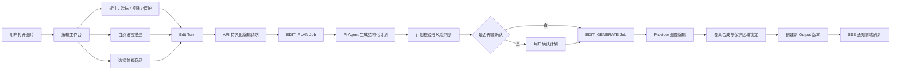

# 图像连续编辑技术设计

本设计基于已确认目标：

- 支持精确局部修改。
- 支持商品替换。
- 支持场景调整。
- 支持扩图。
- 支持自然融合。
- 支持矩形、椭圆、箭头、文字等标注。
- 支持涂抹、擦除、保护区域。
- 由用户自然语言和标注信息共同驱动，Agent 自动判断操作类型。
- 每次修改都产生新版本，用户可以继续修改、回退或从历史版本分支。
- 保持低心智负担，不让用户直接面对复杂模式选择。

本轮是技术设计，不修改代码。

## 1. 总体架构



核心原则是：

> Agent 负责理解和规划；应用负责坐标、遮罩、版本、权限和像素边界。

Agent 不直接决定最终哪些像素可以被修改。

***

## 2. 操作类型

内部统一使用以下操作枚举：

```ts
type EditOperation =
  | "PRECISE_INPAINT"
  | "PRODUCT_REPLACE"
  | "SCENE_ADJUST"
  | "OUTPAINT"
  | "NATURAL_FUSION";
```

用户不需要在界面中选择这五个模式。

### Agent 的判断依据

采用四层判断：

1. 用户自然语言。
2. 用户在画布上的操作。
3. 当前图片、历史编辑和项目上下文。
4. Provider 能力和输入完整性校验。

例如：

| 用户行为             | Agent 倾向          |
| ---------------- | ----------------- |
| 圈出商品并说“把它变成红色”   | `PRECISE_INPAINT` |
| 圈出商品并说“换成这个参考商品” | `PRODUCT_REPLACE` |
| 说“换一个更高级的厨房背景”   | `SCENE_ADJUST`    |
| 拖大画布并说“补全边缘”     | `OUTPAINT`        |
| 说“让商品自然融入场景”     | `NATURAL_FUSION`  |

Agent 的结论必须经过确定性校验，不能完全信任模型输出。

例如：

- `PRODUCT_REPLACE` 必须有参考商品素材。
- `OUTPAINT` 必须有新的画布区域。
- `PRECISE_INPAINT` 必须有目标区域。
- 没有参考素材时，Agent 只能提示用户选择素材，不能伪造替换成功。
- Agent 不允许凭空创建不存在的标注 ID 或资产 ID。

***

## 3. 前端交互设计

### 3.1 单一入口

在现有结果查看区域中增加：

```text
编辑图片
```

进入后打开独立的 `EditImageWorkspace`，而不是继续扩展现有重新生成弹窗。

建议改造入口：

- [ReviewStage.tsx](E:\project\EcomGen\apps\web\src\features\workbench\ReviewStage.tsx)
- [ResultsWorkspace.tsx](E:\project\EcomGen\apps\web\src\features\workbench\ResultsWorkspace.tsx)

### 3.2 工具栏

工具栏保持精简：

```text
选择 | 矩形 | 椭圆 | 箭头 | 文字 | 涂抹 | 擦除 | 保护 | 撤销 | 重做 | 缩放
```

工具语义：

- 矩形、椭圆、自由区域：目标区域候选。
- 箭头、文字：语义标注，不直接产生遮罩。
- 涂抹：增加编辑区域。
- 擦除：从编辑区域移除。
- 保护：生成不可修改区域。
- 选择：移动、调整、删除标注。

建议默认规则：

> 用户只画矩形或椭圆时，系统自动把它当作目标区域；箭头和文字只作为 Agent 的说明信息。

这样用户不需要理解“标注层”和“遮罩层”的区别。

### 3.3 Agent 面板

右侧保持一个连续对话面板：

```text
你想怎么修改这张图？

[输入框]

Agent 判断：
将保留主体和构图，只修改选中区域中的商品颜色。
[查看详情] [发送]
```

需要确认时：

```text
这次修改会重新绘制整个背景，主体商品会尽量保持不变。
[确认修改] [调整要求]
```

高风险操作需要确认：

- 商品替换。
- 大范围场景调整。
- 扩图。
- 自然融合。
- 没有明确保护区域的整体重绘。

低风险的精确局部修改，可以直接执行。

### 3.4 连续修改

每次修改完成后：

```text
当前版本：v3

[继续修改] [查看版本] [从此版本分支]
```

“继续修改”默认使用当前输出作为下一轮输入。

用户说：

```text
再亮一点
把右边的阴影去掉
刚才的商品太大了
保持刚才的背景，但换回原来的商品
```

Agent 会基于：

- 当前输出。
- 当前编辑会话摘要。
- 最近几轮编辑。
- 项目事实。
- 当前选择的参考资产。

继续理解，而不是重新开始。

***

## 4. 标注和遮罩数据结构

前端不要保存 CSS 坐标，统一使用原图坐标或归一化坐标。

推荐格式：

```ts
type EditAnnotationDocument = {
  sourceWidth: number;
  sourceHeight: number;
  annotations: Array<{
    id: string;
    type: "rect" | "ellipse" | "arrow" | "text" | "freehand";
    points?: Array<{ x: number; y: number }>;
    bounds?: { x: number; y: number; width: number; height: number };
    text?: string;
    semanticRole?: "target" | "instruction" | "remove" | "add";
  }>;
  maskStrokes: Array<{
    mode: "add" | "erase" | "protect";
    size: number;
    points: Array<{ x: number; y: number }>;
  }>;
};
```

建议额外生成两个 PNG：

```text
edit-mask.png
protect-mask.png
```

其中：

- `edit-mask.png`：允许模型修改的区域。
- `protect-mask.png`：必须保护的区域。

擦除操作只修改 `edit-mask`，保护操作不应被编辑区域覆盖。

遮罩必须在服务端重新校验：

- 尺寸是否匹配源图。
- MIME 是否正确。
- 是否属于当前项目。
- 是否超过大小限制。
- 是否与客户端声明的 hash 一致。

客户端画布只负责交互，服务端负责最终可信数据。

***

## 5. Agent 结构化协议

Pi Agent 可以新增一个专门的 edit planner，复用现有规划适配器，而不是再引入新的 Agent 框架。

建议返回结构：

```ts
type EditPlan = {
  operation: EditOperation;
  confidence: number;

  userSummary: string;
  prompt: string;

  targetAnnotationIds: string[];
  referenceAssetIds: string[];

  maskPolicy:
    | "USE_USER_MASK"
    | "USE_ANNOTATION_REGION"
    | "EXPAND_USER_MASK"
    | "FULL_SCENE";

  protectionPolicy:
    | "PIXEL_LOCKED"
    | "PROTECT_USER_MASK"
    | "ALLOW_BROAD_CHANGE";

  compositePolicy:
    | "MASK_LOCKED"
    | "NATURAL_BLEND"
    | "OUTPAINT";

  providerRequirements: string[];

  requiresConfirmation: boolean;
  riskFlags: string[];

  memoryPatch?: {
    summary?: string;
    constraints?: string[];
  };
};
```

Agent 不直接返回图片遮罩坐标，只引用已有的 `annotationId`。

### 计划校验器

在 Worker 中增加确定性校验：

```text
EditPlan
  -> operation 合法性
  -> 资产权限
  -> 标注 ID 存在性
  -> 遮罩要求
  -> Provider 能力
  -> 风险确认状态
```

如果 Agent 判断为商品替换，但没有参考素材：

```text
状态：NEED_INPUT
提示：请选择一个参考商品后再进行替换。
```

不会执行模糊的降级操作。

***

## 6. API 设计

现有初始生图继续使用：

```text
POST /api/v1/projects/:projectId/generation-jobs
```

连续编辑建议使用独立 API，不和初始分镜生成混在一起。

### 创建编辑会话

```http
POST /api/v1/projects/:projectId/outputs/:outputId/edit-sessions
```

响应：

```json
{
  "sessionId": "edit_session_123",
  "currentOutputId": "output_456",
  "status": "ACTIVE"
}
```

### 提交一轮编辑

```http
POST /api/v1/edit-sessions/:sessionId/turns
Content-Type: multipart/form-data
```

字段：

```text
baseOutputId
message
annotations.json
edit-mask.png
protect-mask.png
referenceAssetIds[]
canvasExpansion.json
```

响应：

```json
{
  "turnId": "edit_turn_123",
  "planJobId": "job_789",
  "status": "PLANNING"
}
```

### 获取计划

```http
GET /api/v1/edit-turns/:turnId
```

返回：

```json
{
  "turnId": "edit_turn_123",
  "status": "AWAITING_CONFIRMATION",
  "plan": {
    "operation": "PRODUCT_REPLACE",
    "userSummary": "将左侧菠萝替换为参考商品，并保持厨房光线和构图。",
    "requiresConfirmation": true
  }
}
```

### 批准计划

```http
POST /api/v1/edit-turns/:turnId/approve
```

### 继续编辑

不需要额外接口，继续调用：

```http
POST /api/v1/edit-sessions/:sessionId/turns
```

系统默认取 `currentOutputId` 作为 `baseOutputId`。

### 选择历史版本

```http
POST /api/v1/edit-sessions/:sessionId/select-output
```

这样用户可以从旧版本继续创建新分支。

***

## 7. 任务与状态机

现有任务类型有：

```text
plan | copywrite | generate | export
```

建议增加：

```text
edit_plan
edit_generate
```

不要把编辑请求塞进普通 `generate`，因为编辑具有：

- 计划阶段。
- 用户确认阶段。
- 遮罩和参考图。
- 版本父子关系。
- 连续会话。
- 不同的幂等指纹。

编辑回合状态：

```text
DRAFT
  -> PLANNING
  -> PLAN_READY
  -> AWAITING_CONFIRMATION
  -> GENERATING
  -> SUCCEEDED
```

异常状态：

```text
NEED_INPUT
FAILED
CANCELLED
```

重要不变量：

- 只有 `SUCCEEDED` 才创建新 Output。
- 生成失败不能创建伪成功结果。
- 当前版本只在新 Output 成功后更新。
- 用户从历史版本继续时，创建新分支，不覆盖旧版本。
- 同一个编辑请求重复提交时，复用已有任务。

***

## 8. 版本模型

现有 `outputs` 需要增加版本关系：

```text
parent_output_id
root_output_id
edit_session_id
edit_turn_id
```

`generationSnapshot` 扩展为：

```json
{
  "providerId": "provider_x",
  "modelId": "model_y",
  "operation": "PRECISE_INPAINT",
  "sourceOutputId": "output_123",
  "maskHash": "sha256...",
  "protectMaskHash": "sha256...",
  "referenceAssetIds": [],
  "inputFidelity": "high",
  "compositePolicy": "MASK_LOCKED"
}
```

旧输出的这些字段允许为空，不需要破坏历史数据。

推荐版本关系：

```text
v1
├── v2
│   └── v3
└── v4
    └── v5
```

其中：

- `v3` 可以继续修改。
- `v1` 可以重新分支生成 `v6`。
- 任意旧版本都不可变。
- 前端通过父子关系渲染版本树。

***

## 9. 存储设计

现有输出继续使用：

```text
outputs/{projectId}/...
```

编辑中间产物单独存储：

```text
edits/{projectId}/{sessionId}/{turnId}/
  annotation.json
  edit-mask.png
  protect-mask.png
  plan.json
```

不要把遮罩当成普通商品素材放进 `assets`，原因是：

- 遮罩只属于某一轮编辑。
- 遮罩不应该出现在商品素材列表。
- 遮罩需要和编辑回合一一对应。
- 旧版本需要保留其原始遮罩和计划。

***

## 10. Provider 能力扩展

当前 Provider 接口只有较粗粒度的能力描述，需要增加：

```ts
type ImageCapabilities = {
  supportsMaskEdit: boolean;
  supportsMultiReference: boolean;
  supportsOutpaint: boolean;
  supportsInputFidelity: boolean;
  supportsNaturalBlend: boolean;
};
```

现有：

- [packages/providers/src/openai-compatible.ts](E:\project\EcomGen\packages\providers\src\openai-compatible.ts)
- [packages/contracts/src/index.ts](E:\project\EcomGen\packages\contracts\src\index.ts)

建议将输入从：

```ts
images?: ImageInput[];
```

扩展为：

```ts
type ImageEditInput = {
  sourceImage: ImageInput;
  referenceImages?: ImageInput[];
  mask?: ImageInput;
  inputFidelity?: "low" | "high";
  operation: EditOperation;
};
```

这样可以明确区分：

- 当前待修改图片。
- 商品参考图。
- 遮罩。
- Provider 运行模式。

OpenAI 图像编辑接口支持图片和 mask 输入，可作为第一阶段适配目标：

[OpenAI Image Generation and Editing](https://developers.openai.com/api/docs/guides/image-generation)

其他 Provider 的 mask 行为可能不同，例如部分模型不会完全保护未遮罩区域，因此不能直接把模型输出当最终结果。

***

## 11. 像素保护与自然融合

### 精确修改

对于 `MASK_LOCKED`：

```text
最终图 = 生成图 × 编辑遮罩
       + 原图 × 非编辑遮罩
```

保护区域优先级更高：

```text
最终编辑区域 = editMask - protectMask
```

即使模型修改了未选区域，也由应用层使用原图恢复。

这一步是实现“精准修改”的关键，不能只依赖 Provider 自己理解 mask。

### 自然融合

对于 `NATURAL_BLEND`：

- 允许边缘一定程度重绘。
- 使用软遮罩和边缘羽化。
- 保护用户明确标记的区域。
- 结果需要在计划中标记为高风险，默认请求确认。

### 扩图

对于 `OUTPAINT`：

- 原图区域保持固定。
- 新增画布区域由模型生成。
- 不应把整张图当成普通 inpaint 处理。
- 需要保存画布扩展方向和尺寸。

***

## 12. 连续对话和长记忆

Pi Agent 可以每轮重新创建，但上下文必须由应用持久化和组装。

每轮规划时传入：

```text
项目事实
+ 当前 Output 信息
+ 当前编辑会话摘要
+ 最近若干轮对话
+ 最近若干轮计划
+ 参考资产说明
+ 当前标注和遮罩元数据
```

不建议无限制把全部历史消息传给 Agent。

### 两层记忆

会话记忆：

```text
edit_sessions.memory_summary_json
```

保存：

- 当前商品身份。
- 用户持续要求。
- 已确认的构图约束。
- 已确认的品牌规则。
- 当前分支目标。

项目记忆：

- 项目级商品事实。
- 品牌规范。
- 可复用参考素材。
- 全局禁用元素。

项目记忆可以跨图片复用；编辑会话记忆只绑定当前图片分支。

***

## 13. 与现有代码的对应关系

| 位置                                            | 技术改造                              |
| --------------------------------------------- | --------------------------------- |
| `apps/web/.../ReviewStage.tsx`                | 增加编辑入口和当前版本入口                     |
| `apps/web/.../ResultsWorkspace.tsx`           | 从重新生成改为创建编辑会话                     |
| `apps/api`                                    | 新增 edit session、turn、approve 路由   |
| `apps/worker/src/worker.ts`                   | 增加 edit plan 和 edit generate 执行器  |
| `packages/agent/src/planner.ts`               | 增加结构化 edit planner                |
| `packages/contracts/src/index.ts`             | 增加编辑协议、状态、操作枚举                    |
| `packages/core/src/repository.ts`             | 增加会话、回合、计划和输出血缘                   |
| `packages/core/src/database.ts`               | 增加编辑表并迁移 outputs                  |
| `packages/core/src/files.ts`                  | 增加编辑中间文件存储                        |
| `packages/providers/src/openai-compatible.ts` | 支持 source、reference、mask、fidelity |

前端画布建议采用：

```text
react-konva：图片、标注、选择、变换
Canvas：编辑遮罩和保护遮罩
```

这样标注和像素遮罩分离，避免把自由绘制逻辑全部压在同一个图层中。

***

## 14. 分阶段落地

### 第一阶段：精确局部修改

范围：

- 编辑工作台。
- 矩形、椭圆、涂抹、擦除、保护。
- 当前 Output 作为源图。
- OpenAI-compatible mask edit。
- 服务端像素锁定。
- Output 父子版本。
- 连续修改。

这是最重要的基础闭环。

### 第二阶段：Agent 自动路由

范围：

- 自然语言判断操作类型。
- 计划展示和确认。
- 会话摘要。
- 低风险自动执行。
- 商品替换。
- 参考商品选择。

### 第三阶段：场景与扩图

范围：

- 场景调整。
- 扩图。
- 自然融合。
- 多参考图。
- Provider 能力路由。

### 第四阶段：质量和运营能力

范围：

- 版本对比。
- 编辑质量评分。
- Provider 成功率统计。
- 失败原因归类。
- 复杂编辑的人工确认节点。
- 任务取消和恢复优化。

***

## 15. 关键测试

必须优先保护这些真实风险：

1. 遮罩外像素锁定测试。
2. 保护遮罩覆盖编辑遮罩时的优先级测试。
3. 输出父子版本和分支测试。
4. 重复提交的幂等测试。
5. 参考素材不属于当前项目时的权限测试。
6. Agent 返回非法 annotation ID 时的拒绝测试。
7. Provider 不支持 mask 或 outpaint 时的明确失败测试。
8. 连续修改默认使用当前 Output 的测试。
9. 商品替换缺少参考素材时进入 `NEED_INPUT` 的测试。
10. Worker 失败时不创建成功 Output 的测试。

***

## 16. 设计自检结论

通过“grill-me”式反向检查后，几个边界已经明确：

- Agent 可以判断操作类型，但不能绕过遮罩和资产校验。
- 用户不需要理解五种模式，模式只在计划摘要中展示。
- 标注、编辑遮罩、保护遮罩必须是三个不同概念。
- 模型输出不能直接作为最终图，精确修改必须经过像素合成。
- 连续对话不能只依赖 Pi Agent 的内存，应用数据库必须保存编辑事实。
- 所有修改都创建新版本，不覆盖原图。
- Provider 不支持某能力时必须明确报错，不能静默换成完全不同的操作。
- 商品替换、场景调整、扩图和自然融合都纳入同一编辑会话，不再另起一套产品流程。

最终建议采用这一条主链路：

```text
当前图片
→ 标注 / 遮罩 / 自然语言
→ Agent 结构化计划
→ 风险确认
→ Provider 编辑
→ 像素保护与合成
→ 新版本
→ 继续对话
```

下一步可以直接把这份设计拆成三份可执行文档：`编辑领域契约`、`API/OpenAPI 变更`、`前后端实施任务清单`，然后进入第一阶段实现。
